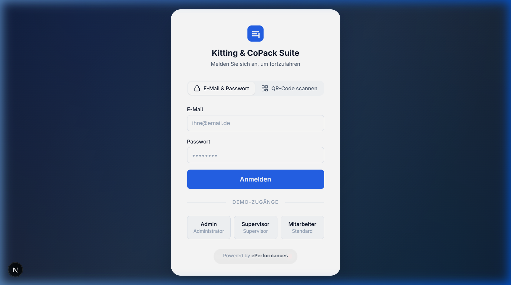
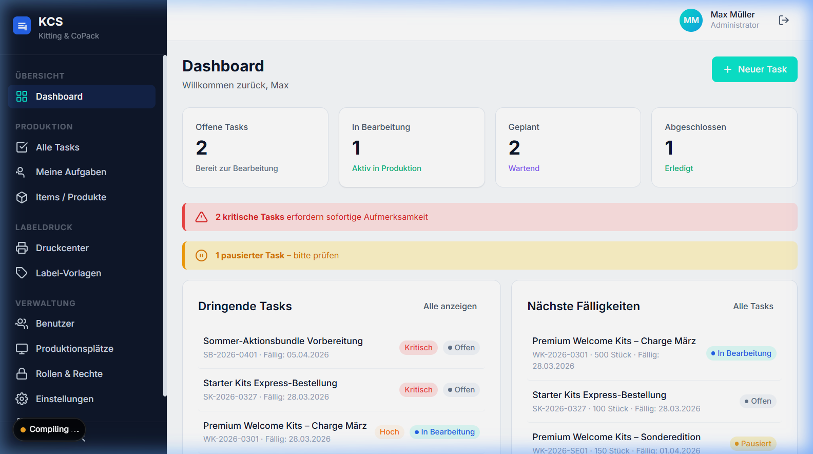
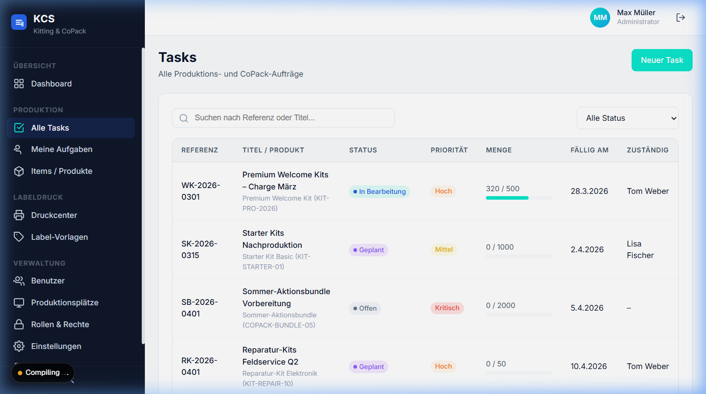
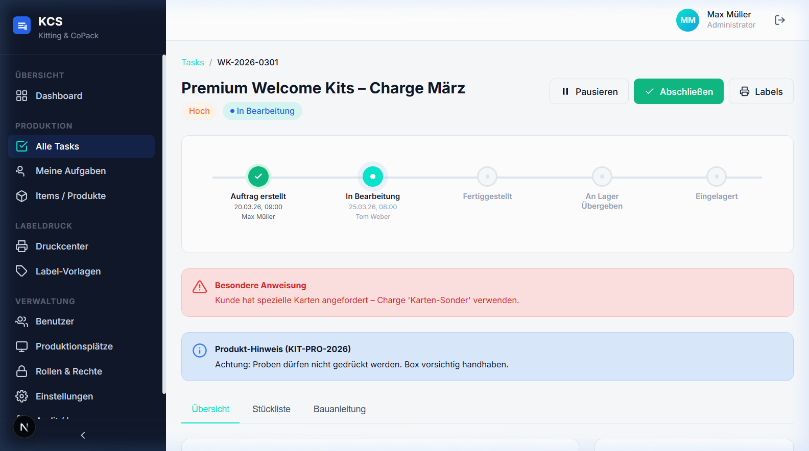
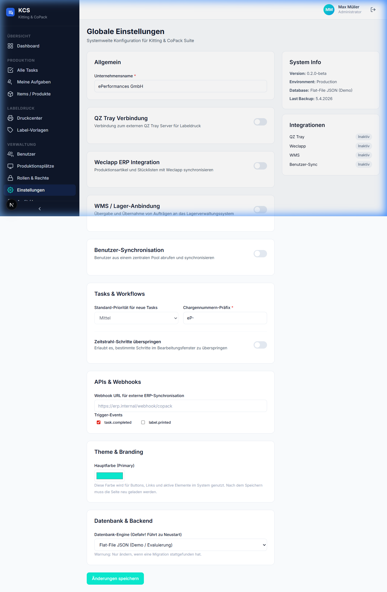

# 📦 Kitting & CoPack Suite

[](LICENSE.md)
[](#)
[](https://nextjs.org/)
[](https://www.typescriptlang.org/)

Die **Kitting & CoPack Suite** ist eine moderne, skalierbare Web-Applikation zur effizienten Verwaltung von Artikeln, Etiketten (ZPL), Konfektionierungsaufträgen (Kitting) und Benutzern in einem Lager- oder Produktionsumfeld.

---

## ✨ Hauptfunktionen

| Feature | Beschreibung |
|---|---|
| 📋 **Auftragsmanagement** | Verwaltung von Kitting- und CoPack-Aufträgen mit 5-Schritt-Timeline |
| 📦 **Artikelverwaltung** | Produkte mit EAN, Stücklisten (BOM) und Arbeitsanweisungen |
| 🏷️ **Visueller Label Editor** | WYSIWYG-Editor für ZPL-Etiketten mit Barcode & QR-Code |
| 🖨️ **Print Center** | Zentrale Drucksteuerung über ZPL-direkt oder QZ Tray |
| 👥 **Benutzer & Rollen** | Rollenbasiertes Rechtemanagement (Admin, Supervisor, User) |
| 🏭 **Produktionsplätze** | Workstation-Zuordnung für Produktionsmitarbeiter |
| 🔗 **Weclapp ERP** | Produktionsartikel-Synchronisation (nur per Knopfdruck) |
| 📡 **WMS-Anbindung** | Konfigurierbare Lagerübergabe (Webhook oder WMS-Nachricht) |
| 📱 **QR-Code Login** | Anmeldung per Kamera-Scan eines QR-Codes mit Zugangsdaten |
| ⏩ **Flexible Timeline** | Konfigurierbar: Bearbeitungsschritte überspringen |

---

## 📸 Screenshots

### Login mit QR-Code-Scanner



### Dashboard — Übersicht & Statistiken



### Auftragsübersicht (Tasks)



### Task-Detail mit 5-Schritt-Timeline



### Globale Einstellungen & Integrationen



---

## 🏗️ Architektur

```
┌─────────────────────────────────────────────────────┐
│                    Next.js App Router                │
│  ┌──────────┐  ┌──────────┐  ┌───────────────────┐ │
│  │ Dashboard │  │  Login   │  │  Admin Settings   │ │
│  │  (Tasks,  │  │ (E-Mail, │  │  (Weclapp, WMS,   │ │
│  │  Items,   │  │  QR-Code)│  │   QZ Tray, Users) │ │
│  │  Labels)  │  │          │  │                   │ │
│  └────┬─────┘  └────┬─────┘  └────────┬──────────┘ │
│       │              │                  │            │
│  ┌────┴──────────────┴──────────────────┴──────────┐ │
│  │              API Routes (REST)                   │ │
│  │  /api/tasks  /api/items  /api/auth  /api/weclapp│ │
│  │  /api/users  /api/wms    /api/settings          │ │
│  └────┬─────────────────────────────────────────────┘ │
│       │                                               │
│  ┌────┴─────────────────────────────┐                 │
│  │     Data Layer (Repository)      │                 │
│  │  Flat-File JSON │ MySQL │ Firebase│                │
│  └──────────────────────────────────┘                 │
└─────────────────────────────────────────────────────┘
            │                    │
     ┌──────┴──────┐    ┌───────┴───────┐
     │  QZ Tray    │    │   Weclapp     │
     │  (Drucker)  │    │   ERP API     │
     └─────────────┘    └───────────────┘
```

---

## 🚀 Lokale Installation & Entwicklung

### Voraussetzungen

- **Node.js** ≥ 18.x
- **NPM** (oder Yarn / PNPM)

### Schnellstart

```bash
# 1. Repository klonen
git clone https://github.com/CptGummiball/Kitting-CoPack-Suite.git
cd Kitting-CoPack-Suite

# 2. Abhängigkeiten installieren
npm install

# 3. Entwicklungsserver starten
npm run dev
```

Öffne [http://localhost:3000](http://localhost:3000) im Browser.

### Demo-Zugänge

| Rolle | E-Mail | Passwort |
|---|---|---|
| Administrator | `admin@kitting-suite.local` | `admin` |
| Supervisor | `supervisor@kitting-suite.local` | `supervisor` |
| Mitarbeiter | `worker@kitting-suite.local` | `worker` |

---

## ⚙️ Konfiguration

Alle Einstellungen werden über das Admin-Panel unter **Einstellungen** verwaltet.

### Integrationen

| Integration | Beschreibung |
|---|---|
| **QZ Tray** | Druckserver-Anbindung über WebSocket. Bei erster Verbindung muss die Anfrage am Host bestätigt werden. |
| **Weclapp ERP** | Artikel-Synchronisation (nur Produktionsartikel + BOM-Kinder). Manuell per Knopfdruck. |
| **WMS** | Lagerübergabe per einfachem Webhook oder strukturierter WMS-Nachricht. |
| **Benutzer-Sync** | Rudimentäre Synchronisation aus externem Benutzer-Pool (REST API). |

### Lagerübergabe-Modi

- **Einfacher Webhook**: POST an eine konfigurierbare URL mit optionalem Secret-Header
- **WMS-Nachricht**: Strukturiertes JSON an ein WMS-System mit Auftragsdetails

### Timeline-Konfiguration

Im Admin-Panel kann aktiviert werden, dass bestimmte Bearbeitungsschritte übersprungen werden dürfen (z.B. direkt von „Offen" zu „Fertiggestellt").

---

## 🔧 Technologiestack

| Layer | Technologie |
|---|---|
| Frontend | React 19, Next.js 16 (App Router) |
| Sprache | TypeScript 5 |
| Styling | Vanilla CSS mit Design Tokens |
| Druck | ZPL (Zebra), QZ Tray (WebSocket) |
| Daten | Flat-File JSON (Demo), MySQL/Firebase (Produktion) |
| Auth | localStorage Session (Demo), erweiterbar |
| QR-Code | `qrcode` (Generierung), eigene Poll-API |

---

## 📖 Dokumentation

Die vollständige Dokumentation befindet sich im [wiki/](./wiki/) Verzeichnis:

- [Home](./wiki/Home.md) — Übersicht & Navigation
- [Installation](./wiki/Installation.md) — Setup-Guide
- [Konfiguration](./wiki/Konfiguration.md) — Alle Settings
- [Auftragsmanagement](./wiki/Auftragsmanagement.md) — Tasks & Timeline
- [Integrationen](./wiki/Integrationen.md) — Weclapp, WMS, QZ Tray

---

## 📜 Lizenz

Dieses Projekt steht unter der [MIT-Lizenz](LICENSE.md).

---

## 🤝 Contributing

1. Fork erstellen
2. Feature-Branch anlegen (`git checkout -b feature/neues-feature`)
3. Änderungen committen (`git commit -m 'feat: Beschreibung'`)
4. Branch pushen (`git push origin feature/neues-feature`)
5. Pull Request erstellen

---

Built with ❤️ by **ePerformances**
